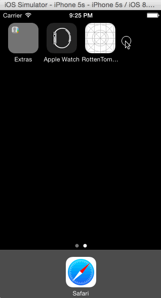

## [CodePath Spring '15] Week 1 Assignment: Rotten Tomatoes App

Inspired by Flixster, this is an app that displays movies currently in the theaters and newly released DVDs using the [Rotten Tomatoes API](http://developer.rottentomatoes.com/docs/read/JSON).

Time spent: ~20 hours

### Features

#### Required

- [ X ] User can view a list of movies. Poster images load asynchronously.
- [ X ] User can view movie details by tapping on a cell.
- [ X ] User sees loading state while waiting for the API.
- [ X ] User sees error message when there is a network error.
- [ X ] User can pull to refresh the movie list.

#### Optional

- [ X ] Added a tab bar for Theaters and DVD.
- [ X ] Added custom icons in tab bar (from [The Noun Project](https://thenounproject.com/))
- [ X ] Customize the navigation bar (custom text depending on tab bar selection)
- [ X ] In detail view, first loading thumbnail size before loading detail size (original size not needed given my design of the detail view)
- [ X ] Displaying the fresh/rotten tomato and fresh/spilt popcorn icons based on critic and audience score, respectively

#### Other notables

- App is currently designed for iPhone 5/5s
- Design of app was inspired by the Flixster app who owns Rotten Tomato (I happen to know the founders of Flixster)
- Running time is displayed in human friendly way (e.g. 2 hr. 14 min.)
- If no critic score (which I guess can happen with new movies), "NONE" is displayed in place of fresh/rotten tomato icon and score
- Beyond getting a functioning app, I spent a good amount of time on code organization, clarity, and patterns:
  * Defined a `Movie` object instead of using `NSDictionary`
  * API code was abstracted into `RottenTomatoesAPI` using callbacks for code reuse
  * All constants were defined in Constants.swift (unclear if this is a good pattern as I'm new to the language)
  
### Walkthroughs

This is a walkthrough of the basic features:

This shows the Network Error message when wifi is turned off.  Error message is removed when wifi is turned back on and the API calls succeed:

Credits
---------
* [Flixster](http://www.flixster.com/)
* [Rotten Tomatoes API](http://developer.rottentomatoes.com/docs/read/JSON)
* [The Noun Project](https://thenounproject.com)
* [AFNetworking](https://github.com/AFNetworking/AFNetworking)
